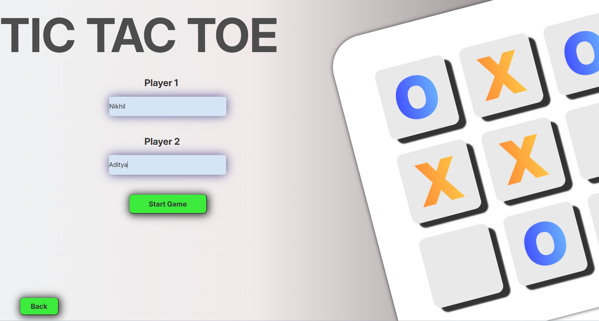

# 🎮 Tic Tac Toe Game Website

**Live Demo ➜** [Click here to play!](https://shindenikhil8.github.io/Tic-Tac-Toe_game_website.github.io/)

Welcome to my **interactive and animated Tic Tac Toe web game** built using HTML, CSS, and JavaScript! This game isn't just fun — it's beautifully designed, feature-rich, and responsive.

---

## 🧩 Features

🟢 **Two Game Modes**
- 🧑‍🤝‍🧑 Play with a Friend
- 🤖 Play against Computer (Randomized AI)

🎨 **Custom Design Options**
- Choose your own **background**
- Select from a range of **avatars**

⏱️ **Animated Countdown**
- "Ready Steady Go" start animation

🎈 **Victory Celebrations**
- Balloons animation for winner
- Tie and win messages with styled UI

🧠 **Smart Game Logic**
- Valid move detection
- Win/draw condition checking
- Random AI behavior for computer

---

## 🛠️ Technologies Used

| Tech        | Purpose                        |
|-------------|--------------------------------|
| `HTML`      | Structure of the web pages     |
| `CSS`       | Styling, layout, responsiveness, animations |
| `JavaScript`| Game logic, DOM interaction, mode switching |

---

## 🧭 Step-by-Step Walkthrough

### 🪜 Step 1: Launch the Game  
**Click the play button to enter the game screen.**

  

Home Page

---

### 🪜 Step 2: Choose Game Mode  
**Pick whether to play with a friend or the computer.**

  

Mode Selection & Settings Option

---

### 🪜 Step 3: Enter Player Details  
**Provide names for players before starting.**

<table>
  <tr>
    <td></td>
    <td></td>
  </tr>
  <tr>
    <td align="center">Friends Input Section</td>
    <td align="center">Computer Input Section</td>
  </tr>
</table>

---

### 🪜 Step 4: Customize Your Game  
**Select avatars and backgrounds from the gallery.**

  

Settings Menu

<table>
  <tr>
    <td></td>
    <td></td>
  </tr>
  <tr>
    <td align="center">Avatar Selection</td>
    <td align="center">Background Selection</td>
  </tr>
</table>

---

### 🪜 Step 5: Play the Game & See Results

**Play the game with full animations, avatars, and win/tie detection!**

<table>
  <tr>
    <td></td>
    <td></td>
    <td></td>
  </tr>
  <tr>
    <td align="center">Play with Friends (In Progress)</td>
    <td align="center">Play with Friends (Winning)</td>
    <td align="center">Play with Computer & Gmae start Timer display</td>
  </tr>
</table>
